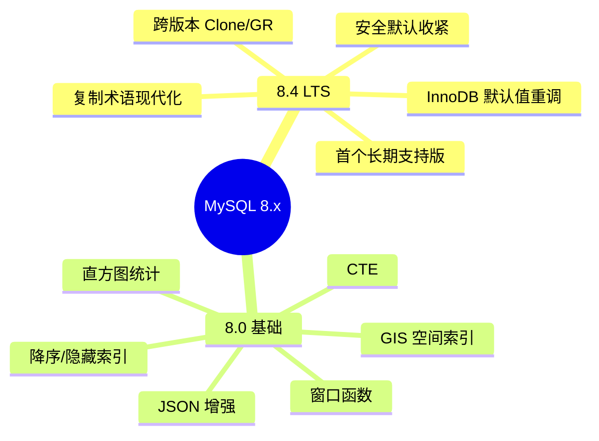
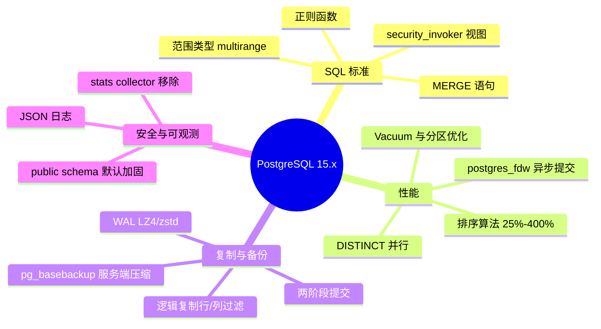
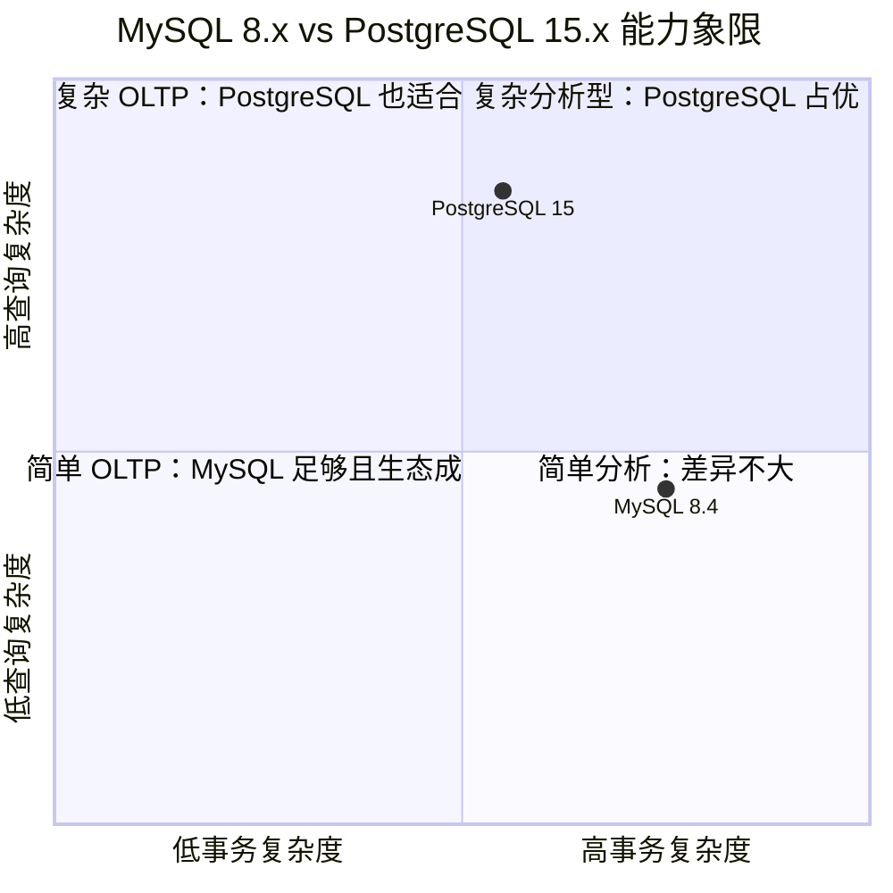
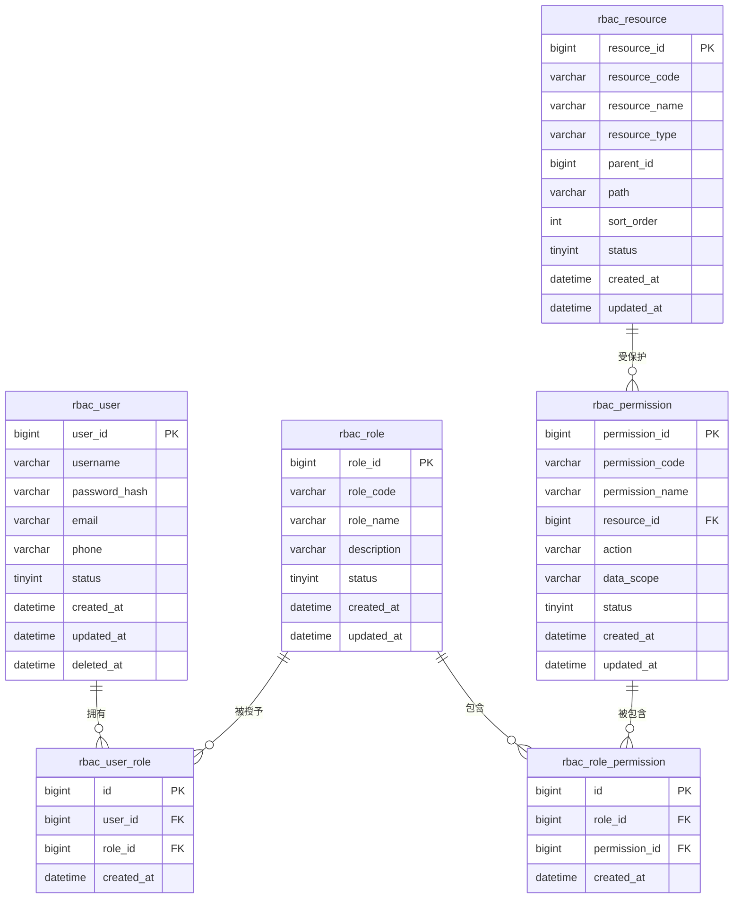

# MySQL 8.x（含 8.4 LTS）与 PostgreSQL 15.x 特性对比及 RBAC 权限系统表结构设计

> 文档说明：本文面向需要在 MySQL 8.x 与 PostgreSQL 15.x 之间做技术选型的架构师/DBA。内容覆盖最新版本特性、核心能力对比、各自适用场景，并给出一份可在两套数据库上直接落地的 RBAC 权限系统表结构。
> 
> 版本基准（截至 2026-08）：
> - MySQL 8.x 最新长期支持版：**MySQL 8.4 LTS**（首个 LTS，8.4.0 发布于 2024-04-30，最新补丁 8.4.11 发布于 2026-06-30）。
> - PostgreSQL 15.x 最新补丁版：**PostgreSQL 15.19**（2026-08-10 发布，15.0 发布于 2022-10-13）。

---

## 目录

1. [版本速览](#1-版本速览)
2. [MySQL 8.x 核心特性](#2-mysql-8x-核心特性)
3. [PostgreSQL 15.x 核心特性](#3-postgresql-15x-核心特性)
4. [MySQL vs PostgreSQL 特性对比](#4-mysql-vs-postgresql-特性对比)
5. [各自特点详细描述](#5-各自特点详细描述)
6. [标准 RBAC 权限系统表结构设计](#6-标准-rbac-权限系统表结构设计)
7. [参考资料](#7-参考资料)

---

## 1. 版本速览

### 1.1 MySQL 8.x 版本策略

| 版本线 | 定位 | 发布/支持情况 | 适合场景 |
|--------|------|---------------|----------|
| MySQL 8.0.x | 持续交付（Innovation 之前的主流线） | 2018 年发布；8.0.34 之后仅修复 bug；社区版 2026-04 EOL | 已在跑 8.0 的存量业务 |
| MySQL 8.1/8.2/8.3 | 创新版（Innovation Releases） | 短周期、引入新功能，不保证长期兼容 | 尝鲜新功能、非核心系统 |
| **MySQL 8.4.x LTS** | **首个长期支持版** | 2024-04-30 发布；主要支持到 2029-04，延长支持到 2032-04 | **新项目和追求稳定的生产环境首选** |

MySQL 8.4 的核心目标是：**更强的安全默认、更合理的 InnoDB 默认值、更现代的复制术语、更长的支持周期**。

### 1.2 PostgreSQL 15.x 版本策略

PostgreSQL 采用“每年一个大版本、5 年支持周期”的固定节奏：

- **15.0**：2022-10-13 发布。
- **15.19**：2026-08-10 发布（最新补丁）。
- **EOL**：预计 2027-11。

15.x 是一个**性能、安全、SQL 标准兼容性并重**的成熟版本，适合作为新项目的主力版本。

---

## 2. MySQL 8.x 核心特性

### 2.1 版本与发布模式

- **双轨模式**：Innovation Release（快速迭代）+ Long-Term Support Release（稳定长周期）。
- 8.4 是 8.x 第一个 LTS，后续 8.4.x 仅修复 bug 和安全问题，功能冻结。

### 2.2 安全与认证

| 特性 | 说明 |
|------|------|
| 默认认证插件 | `caching_sha2_password` 保持默认，安全性优于旧的 `mysql_native_password`。 |
| `mysql_native_password` | 8.4 起**默认禁用**，需显式设置 `mysql_native_password=ON` 开启；9.0 起将彻底移除。 |
| TLS | 仅允许 TLS 1.2/1.3，弱加密套件被移除。 |
| 新权限 | `FLUSH_PRIVILEGES`、`OPTIMIZE_LOCAL_TABLE`、`TRANSACTION_GTID_TAG` 等更细粒度权限。 |
| `SET_USER_ID` 移除 | 改为 `SET_ANY_DEFINER` + `ALLOW_NONEXISTENT_DEFINER`。 |

### 2.3 InnoDB 引擎增强

MySQL 8.4 对 InnoDB 默认参数进行了大幅调整，更适配现代 SSD/大内存服务器：

| 参数 | MySQL 8.0 默认值 | MySQL 8.4 默认值 | 影响 |
|------|------------------|------------------|------|
| `innodb_flush_method` | `fsync` | Linux 上 `O_DIRECT` | 减少 OS 页缓存 double-buffer，提升写性能。 |
| `innodb_log_buffer_size` | 16 MB | 64 MB | 大事务/批量写入更高效。 |
| `innodb_io_capacity` | 200 | 10000 | 默认按 SSD 能力设定。 |
| `innodb_change_buffering` | `all` | `none` | 现代 SSD 上 change buffer 收益下降，关闭可减少后台 IO。 |
| `innodb_adaptive_hash_index` | `ON` | `OFF` | 默认关闭 AHI，避免 DDL 抖动和高并发锁竞争。 |
| `innodb_buffer_pool_instances` | 8 | 基于 BP 大小/CPU 核数动态计算（1–64） | 大内存实例扩展性更好。 |
| `innodb_redo_log_capacity` | 基于内存 | 基于 CPU 核数，可在线调整 | 无需重启即可调整 Redo Log 容量。 |
| `innodb_dedicated_server` | `OFF` | `ON`（自动检测） | 专用服务器自动优化关键参数。 |
| 外键约束 | 父表只需索引 | 默认要求父表引用列有唯一索引 | `restrict_fk_on_non_standard_key=ON`。 |

其他 InnoDB 相关改进：
- **并行读/并行 DDL**：`innodb_parallel_read_threads`、`innodb_ddl_threads`、`innodb_ddl_buffer_size` 进一步强化，大表 `COUNT(*)`、`CREATE INDEX`、`OPTIMIZE TABLE` 显著提速。
- **长事务回滚进度**：长回滚在 error log 中输出更清晰进度信息。

### 2.4 复制与高可用

- **术语现代化**：`MASTER/SLAVE` 全面替换为 `SOURCE/REPLICA`；旧语句（`SHOW MASTER STATUS`、`START SLAVE` 等）在 8.4 中已移除。
- `SOURCE_RETRY_COUNT` 默认值从 86400 改为 **10**。
- `START REPLICA ... SQL_AFTER_GTIDS` 兼容 **MTA（多线程 Applier）**。
- **GTID 标签**：GTID 格式扩展，支持为事务组打标签，便于区分管理/业务事务。
- **Group Replication**：
  - `group_replication_consistency` 默认改为 `BEFORE_ON_PRIMARY_FAILOVER`。
  - `group_replication_exit_state_action` 默认改为 `OFFLINE_MODE`。
  - 同一 8.4 系列内支持跨小版本组成员。
- **Clone 插件**：放宽版本匹配，主/次版本一致即可（如 8.4.0 与 8.4.11 互通）。

### 2.5 优化器与性能

- **直方图自动更新**：`ANALYZE TABLE ... AUTO UPDATE` 可在数据变化足够时自动重建直方图。
- **集合运算默认走哈希**：`EXCEPT`、`INTERSECT` 默认使用 hash-based 执行，避免临时表。
- **相关标量子查询优化**：更多场景下可转换为派生表，减少重复执行。
- **MRR（Multi-Range Read）** 在某些负载下性能提升。
- **窗口函数/CTE/JSON**：自 8.0 起已具备，8.4 持续稳定。

### 2.6 MySQL 8.x 关键能力一览



---

## 3. PostgreSQL 15.x 核心特性

### 3.1 SQL 与开发体验

| 特性 | 说明 |
|------|------|
| **SQL 标准 `MERGE`** | 单条语句内完成 INSERT/UPDATE/DELETE 的条件组合，迁移自 Oracle/SQL Server 更平滑。 |
| **正则函数增强** | 新增 `regexp_count()`、`regexp_instr()`、`regexp_like()`、`regexp_substr()`。 |
| **范围类型** | `range_agg()` 支持聚合 `multirange` 类型。 |
| **视图安全调用者** | `CREATE VIEW ... WITH (security_invoker)` 让视图以调用者权限执行，防止提权。 |
| **`NULLS NOT DISTINCT`** | 唯一约束/索引可显式将多个 NULL 视为相同值，更符合部分业务语义。 |

### 3.2 性能与排序

- **排序算法改进**：内存/磁盘排序算法优化，不同数据类型排序速度提升 **25%–400%**。
- **窗口函数优化**：`row_number()`、`rank()`、`dense_rank()`、`count()` 等窗口函数更快。
- **`SELECT DISTINCT` 可并行执行**。
- **`postgres_fdw` 异步提交**：分布式/跨库场景下远端写入性能提升。
- **Vacuum 效率提升**：大表 vacuum 与 autovacuum 更快，索引 vacuum 更高效。
- **分区表查询计划优化**、大 IN/OR 列表处理更高效。
- `hash_mem_multiplier` 默认值从 1.0 提升到 **2.0**，哈希操作可使用更多 `work_mem`。

### 3.3 压缩、备份与恢复

| 特性 | 说明 |
|------|------|
| WAL 压缩 | 支持 **LZ4 / Zstandard(zstd)** 压缩 WAL 文件，节省空间并提升 IO 效率。 |
| 恢复预取 | 部分 OS 支持根据 WAL 预取页面，加快崩溃恢复。 |
| `pg_basebackup` 服务端压缩 | 备份时可直接在服务端生成 gzip/LZ4/zstd 压缩包。 |
| 归档模块 | 支持自定义归档模块（Archive Modules），替代 shell 命令，降低开销。 |

### 3.4 逻辑复制

- **行过滤**：发布端可配置 `WHERE` 条件，只同步符合条件的行。
- **列列表**：发布端可指定只同步部分列。
- **两阶段提交**：逻辑复制支持 2PC，提升分布式事务一致性。
- 更灵活的跨版本、跨云数据同步能力。

### 3.5 安全与权限

- **默认撤销 public schema 的 CREATE 权限**：新集群/新数据库不再允许所有用户随意在 `public` schema 中建对象，减少横向提权风险。
- **`public` schema 所有者改为 `pg_database_owner`**：让数据库所有者真正拥有自己库内 `public` schema 的管理权。
- **SCRAM-SHA-256** 仍是推荐的默认密码认证方式。
- **监控角色**：新增 `pg_read_all_settings` 等预定义角色，便于最小权限监控。

### 3.6 监控、统计与日志

- **移除 stats collector 后台进程**：统计信息写入机制改为共享内存 + 超时刷新，避免 UDP/临时文件瓶颈。
- **`stats_fetch_consistency`**：控制事务内多次读取统计信息的行为（`none` / `cache` / `snapshot`）。
- **JSON 格式日志**：`log_destination = 'jsonlog'`，便于 ELK/Splunk 等日志平台消费。
- `pg_stat_activity`、`pg_stat_database` 等视图新增列，提升可观测性。

### 3.7 PostgreSQL 15.x 关键能力一览



---

## 4. MySQL vs PostgreSQL 特性对比

### 4.1 总体对比表

| 对比维度 | MySQL 8.x（以 8.4 LTS 为代表） | PostgreSQL 15.x |
|----------|-------------------------------|-----------------|
| **主要定位** | Web/OLTP、高并发短事务、读写分离 | 复杂查询/OLAP、企业级、地理空间/时序/全文 |
| **发布模式** | Innovation + LTS 双轨；8.4 首个 LTS | 每年一个大版本，5 年支持周期 |
| **存储引擎** | 插件式；默认 **InnoDB** | 单一但高度可扩展的内核；支持表空间/外部数据包装器 |
| **默认隔离级别** | `REPEATABLE READ`（InnoDB） | `READ COMMITTED` |
| **MVCC 实现** | Undo log + 快照读；存在 gap lock | 多版本元组；读不阻塞写，无 gap lock |
| **SQL 标准符合度** | 持续改进（CTE、窗口函数、JSON） | **更高**，SQL 标准支持者 |
| **复杂查询** | 适合简单/中等复杂度 | **强**：CTE 递归、LATERAL、复杂子查询优化 |
| **索引类型** | B-Tree、Hash（内存）、Full-Text、GIS、JSON 多值索引 | B-Tree、Hash、GiST、GIN、SP-GiST、BRIN、Partial、Expression |
| **JSON 能力** | JSON 类型 + 多值索引、部分更新 | **JSONB** + GIN 索引、丰富操作符、JSON Path |
| **扩展生态** | 有限（官方/第三方插件） | **极强**：PostGIS、TimescaleDB、pgvector、自定义类型/索引/语言 |
| **复制架构** | 异步/半同步/Group Replication + GTID | 流复制（同步/异步）+ 逻辑复制 + 第三方 HA（Patroni） |
| **分片/扩展** | 依赖中间件/云原生分片 | 分区表 + FDW + Citus/Sharding 扩展 |
| **备份工具** | mysqldump、XtraBackup、Clone 插件 | pg_dump、pg_basebackup、pg_upgrade、WAL 归档 |
| **默认认证** | `caching_sha2_password` | SCRAM-SHA-256 |
| **安全模型** | 基于用户/主机/权限表；8.4 默认收紧 | 基于角色/权限/行级安全（RLS），public schema 默认加固 |
| **运维调优** | 参数多，社区/Percona/云厂商工具丰富 | 参数相对集中，可观测视图非常丰富 |
| **许可证** | GPL / 商业版（Oracle） | PostgreSQL License（类 MIT，更宽松） |

### 4.2 能力雷达对比（文字描述）



> 说明：
> - **MySQL** 在“高并发、简单 SQL、读写分离”象限表现最好。
> - **PostgreSQL** 在“复杂 SQL、分析、丰富数据类型、扩展”象限表现最好。
> - 两套数据库都能胜任常见 OLTP，但选型应围绕 **工作负载特征、团队技术栈、生态依赖** 决定。

---

## 5. 各自特点详细描述

### 5.1 MySQL 特点

1. **简单易用、生态成熟**
   - 语法接近传统关系型数据库，开发者学习成本低。
   - LAMP/LEMP、WordPress、电商、互联网金融等领域有大量成熟案例。

2. **InnoDB 引擎统治地位**
   - 聚簇索引、行级锁、MVCC、崩溃恢复完善。
   - 8.4 默认参数已针对现代硬件大幅优化，开箱即用体验好。

3. **高并发短事务优势明显**
   - 主键点查、简单读写性能优秀；读写分离架构成熟。

4. **复制与 Group Replication**
   - 异步/半同步复制部署简单；GTID 保证一致性。
   - Group Replication 提供原生 MGR 高可用方案（但网络/延迟敏感）。

5. **JSON 与文档能力**
   - 8.0+ 支持 JSON 数据类型与多值索引，可在一定程度上替代文档数据库。

6. **注意点**
   - 复杂查询优化器相对保守；大表 DDL 仍需谨慎（虽 8.4 并行 DDL 有改善）。
   - 默认隔离级别 RR 下 gap lock 容易引发锁等待，互联网应用常改为 RC。
   - 8.4 认证/术语变化需要升级前做兼容性测试。

### 5.2 PostgreSQL 特点

1. **SQL 标准兼容度高**
   - 支持标准 `MERGE`、CTE（含递归）、窗口函数、`LATERAL`、复杂子查询。

2. **先进的数据类型与索引**
   - 数组、范围、JSONB、UUID、几何/地理空间（PostGIS）、全文检索、自定义类型。
   - GiST/GIN/BRIN/Partial/Expression 索引让复杂查询能精确命中。

3. **强大的扩展性**
   - 通过扩展可变成时序库（TimescaleDB）、向量库（pgvector）、图数据库等。
   - 支持自定义函数语言（PL/pgSQL、PL/Python、PL/Rust 等）。

4. **MVCC 与并发**
   - 读不阻塞写，默认 RC 隔离级别下几乎没有锁冲突。
   - 但需要定期 VACUUM 回收死元组，15.x 已大幅优化。

5. **逻辑复制与数据集成**
   - 逻辑复制支持库/表/行/列级过滤，跨版本、跨云迁移灵活。
   - `postgres_fdw` 让跨库查询像本地表一样自然。

6. **安全与合规**
   - 基于角色的权限体系、行级安全（RLS）、列级权限、审计扩展。
   - 15 默认加固 public schema，降低多租户/多用户环境风险。

7. **注意点**
   - 高并发简单写入在默认配置下可能不如 MySQL；需要合理调优 `shared_buffers`、`work_mem`、`max_connections`。
   - 大版本升级需使用 `pg_upgrade` 或逻辑复制，不能像小版本一样原地替换。

---

## 6. 标准 RBAC 权限系统表结构设计

### 6.1 设计目标

- 支持 **用户-角色-权限-资源** 四级模型。
- 一个用户可拥有多个角色，一个角色可授予多个权限。
- 权限由 **资源（resource）+ 操作（action）** 定义，支持菜单/API/按钮/数据等不同资源类型。
- 带软删除、时间戳、状态字段，便于生产运维。

### 6.2 ER 图



### 6.3 MySQL 版 DDL

```sql
-- 创建数据库并设置字符集
CREATE DATABASE IF NOT EXISTS rbac_db
  DEFAULT CHARACTER SET utf8mb4
  DEFAULT COLLATE utf8mb4_unicode_ci;

USE rbac_db;

-- 1. 用户表
CREATE TABLE rbac_user (
  user_id         BIGINT UNSIGNED NOT NULL AUTO_INCREMENT COMMENT '用户ID',
  username        VARCHAR(64)  NOT NULL COMMENT '登录名',
  password_hash   VARCHAR(255) NOT NULL COMMENT '密码哈希（bcrypt/argon2）',
  email           VARCHAR(128) COMMENT '邮箱',
  phone           VARCHAR(32)  COMMENT '手机号',
  status          TINYINT      NOT NULL DEFAULT 1 COMMENT '状态：1启用 0禁用',
  created_at      DATETIME     NOT NULL DEFAULT CURRENT_TIMESTAMP COMMENT '创建时间',
  updated_at      DATETIME     NOT NULL DEFAULT CURRENT_TIMESTAMP ON UPDATE CURRENT_TIMESTAMP COMMENT '更新时间',
  deleted_at      DATETIME              DEFAULT NULL COMMENT '软删除时间',
  PRIMARY KEY (user_id),
  UNIQUE KEY uk_username (username),
  UNIQUE KEY uk_email (email),
  KEY idx_status (status)
) ENGINE=InnoDB DEFAULT CHARSET=utf8mb4 COLLATE=utf8mb4_unicode_ci
COMMENT='用户表';

-- 2. 角色表
CREATE TABLE rbac_role (
  role_id     BIGINT UNSIGNED NOT NULL AUTO_INCREMENT COMMENT '角色ID',
  role_code   VARCHAR(64)  NOT NULL COMMENT '角色编码（如 admin/editor）',
  role_name   VARCHAR(128) NOT NULL COMMENT '角色名称',
  description VARCHAR(255) COMMENT '描述',
  status      TINYINT      NOT NULL DEFAULT 1 COMMENT '状态：1启用 0禁用',
  created_at  DATETIME     NOT NULL DEFAULT CURRENT_TIMESTAMP,
  updated_at  DATETIME     NOT NULL DEFAULT CURRENT_TIMESTAMP ON UPDATE CURRENT_TIMESTAMP,
  PRIMARY KEY (role_id),
  UNIQUE KEY uk_role_code (role_code),
  KEY idx_status (status)
) ENGINE=InnoDB DEFAULT CHARSET=utf8mb4 COLLATE=utf8mb4_unicode_ci
COMMENT='角色表';

-- 3. 用户-角色关联表
CREATE TABLE rbac_user_role (
  id        BIGINT UNSIGNED NOT NULL AUTO_INCREMENT COMMENT '自增ID',
  user_id   BIGINT UNSIGNED NOT NULL COMMENT '用户ID',
  role_id   BIGINT UNSIGNED NOT NULL COMMENT '角色ID',
  created_at DATETIME NOT NULL DEFAULT CURRENT_TIMESTAMP,
  PRIMARY KEY (id),
  UNIQUE KEY uk_user_role (user_id, role_id),
  KEY idx_role_id (role_id),
  CONSTRAINT fk_ur_user FOREIGN KEY (user_id) REFERENCES rbac_user(user_id) ON DELETE CASCADE,
  CONSTRAINT fk_ur_role FOREIGN KEY (role_id) REFERENCES rbac_role(role_id) ON DELETE CASCADE
) ENGINE=InnoDB DEFAULT CHARSET=utf8mb4 COLLATE=utf8mb4_unicode_ci
COMMENT='用户角色关联表';

-- 4. 资源表（菜单/API/按钮/数据）
CREATE TABLE rbac_resource (
  resource_id   BIGINT UNSIGNED NOT NULL AUTO_INCREMENT COMMENT '资源ID',
  resource_code VARCHAR(64)  NOT NULL COMMENT '资源编码（如 user:manage）',
  resource_name VARCHAR(128) NOT NULL COMMENT '资源名称',
  resource_type VARCHAR(32)  NOT NULL COMMENT '资源类型：MENU/API/BUTTON/DATA',
  parent_id     BIGINT UNSIGNED DEFAULT NULL COMMENT '父资源ID，支持树形',
  path          VARCHAR(255) COMMENT '路径/URL',
  sort_order    INT DEFAULT 0 COMMENT '排序',
  status        TINYINT NOT NULL DEFAULT 1 COMMENT '状态：1启用 0禁用',
  created_at    DATETIME NOT NULL DEFAULT CURRENT_TIMESTAMP,
  updated_at    DATETIME NOT NULL DEFAULT CURRENT_TIMESTAMP ON UPDATE CURRENT_TIMESTAMP,
  PRIMARY KEY (resource_id),
  UNIQUE KEY uk_resource_code (resource_code),
  KEY idx_parent_id (parent_id),
  KEY idx_type (resource_type)
) ENGINE=InnoDB DEFAULT CHARSET=utf8mb4 COLLATE=utf8mb4_unicode_ci
COMMENT='资源表';

-- 5. 权限表（资源 + 操作）
CREATE TABLE rbac_permission (
  permission_id   BIGINT UNSIGNED NOT NULL AUTO_INCREMENT COMMENT '权限ID',
  permission_code VARCHAR(128) NOT NULL COMMENT '权限编码（如 user:manage:create）',
  permission_name VARCHAR(128) NOT NULL COMMENT '权限名称',
  resource_id     BIGINT UNSIGNED NOT NULL COMMENT '资源ID',
  action          VARCHAR(32)  NOT NULL COMMENT '操作：CREATE/READ/UPDATE/DELETE/EXECUTE',
  data_scope      VARCHAR(32)  DEFAULT 'ALL' COMMENT '数据范围：ALL/DEPT/SELF/CUSTOM',
  status          TINYINT NOT NULL DEFAULT 1,
  created_at      DATETIME NOT NULL DEFAULT CURRENT_TIMESTAMP,
  updated_at      DATETIME NOT NULL DEFAULT CURRENT_TIMESTAMP ON UPDATE CURRENT_TIMESTAMP,
  PRIMARY KEY (permission_id),
  UNIQUE KEY uk_permission_code (permission_code),
  UNIQUE KEY uk_resource_action (resource_id, action),
  KEY idx_resource_id (resource_id),
  CONSTRAINT fk_perm_resource FOREIGN KEY (resource_id) REFERENCES rbac_resource(resource_id) ON DELETE CASCADE
) ENGINE=InnoDB DEFAULT CHARSET=utf8mb4 COLLATE=utf8mb4_unicode_ci
COMMENT='权限表';

-- 6. 角色-权限关联表
CREATE TABLE rbac_role_permission (
  id            BIGINT UNSIGNED NOT NULL AUTO_INCREMENT,
  role_id       BIGINT UNSIGNED NOT NULL COMMENT '角色ID',
  permission_id BIGINT UNSIGNED NOT NULL COMMENT '权限ID',
  created_at    DATETIME NOT NULL DEFAULT CURRENT_TIMESTAMP,
  PRIMARY KEY (id),
  UNIQUE KEY uk_role_permission (role_id, permission_id),
  KEY idx_permission_id (permission_id),
  CONSTRAINT fk_rp_role FOREIGN KEY (role_id) REFERENCES rbac_role(role_id) ON DELETE CASCADE,
  CONSTRAINT fk_rp_permission FOREIGN KEY (permission_id) REFERENCES rbac_permission(permission_id) ON DELETE CASCADE
) ENGINE=InnoDB DEFAULT CHARSET=utf8mb4 COLLATE=utf8mb4_unicode_ci
COMMENT='角色权限关联表';
```

### 6.4 PostgreSQL 版 DDL

```sql
-- 使用独立 schema 存放权限模型
CREATE SCHEMA IF NOT EXISTS rbac;

-- 自动更新 updated_at 的通用函数
CREATE OR REPLACE FUNCTION rbac.set_updated_at()
RETURNS TRIGGER AS $$
BEGIN
  NEW.updated_at = CURRENT_TIMESTAMP;
  RETURN NEW;
END;
$$ LANGUAGE plpgsql;

-- 1. 用户表
CREATE TABLE rbac.users (
  user_id       BIGINT GENERATED ALWAYS AS IDENTITY PRIMARY KEY,
  username      VARCHAR(64)  NOT NULL,
  password_hash VARCHAR(255) NOT NULL,
  email         VARCHAR(128),
  phone         VARCHAR(32),
  status        SMALLINT     NOT NULL DEFAULT 1, -- 1启用 0禁用
  created_at    TIMESTAMPTZ  NOT NULL DEFAULT CURRENT_TIMESTAMP,
  updated_at    TIMESTAMPTZ  NOT NULL DEFAULT CURRENT_TIMESTAMP,
  deleted_at    TIMESTAMPTZ           DEFAULT NULL,
  CONSTRAINT uk_users_username UNIQUE (username),
  CONSTRAINT uk_users_email UNIQUE (email)
);
COMMENT ON TABLE rbac.users IS '用户表';
COMMENT ON COLUMN rbac.users.status IS '状态：1启用 0禁用';
CREATE INDEX idx_users_status ON rbac.users(status);

CREATE TRIGGER trg_users_updated_at
BEFORE UPDATE ON rbac.users
FOR EACH ROW EXECUTE FUNCTION rbac.set_updated_at();

-- 2. 角色表
CREATE TABLE rbac.roles (
  role_id     BIGINT GENERATED ALWAYS AS IDENTITY PRIMARY KEY,
  role_code   VARCHAR(64)  NOT NULL,
  role_name   VARCHAR(128) NOT NULL,
  description VARCHAR(255),
  status      SMALLINT     NOT NULL DEFAULT 1,
  created_at  TIMESTAMPTZ  NOT NULL DEFAULT CURRENT_TIMESTAMP,
  updated_at  TIMESTAMPTZ  NOT NULL DEFAULT CURRENT_TIMESTAMP,
  CONSTRAINT uk_roles_code UNIQUE (role_code)
);
COMMENT ON TABLE rbac.roles IS '角色表';
CREATE INDEX idx_roles_status ON rbac.roles(status);

CREATE TRIGGER trg_roles_updated_at
BEFORE UPDATE ON rbac.roles
FOR EACH ROW EXECUTE FUNCTION rbac.set_updated_at();

-- 3. 用户-角色关联表
CREATE TABLE rbac.user_roles (
  id         BIGINT GENERATED ALWAYS AS IDENTITY PRIMARY KEY,
  user_id    BIGINT NOT NULL REFERENCES rbac.users(user_id) ON DELETE CASCADE,
  role_id    BIGINT NOT NULL REFERENCES rbac.roles(role_id) ON DELETE CASCADE,
  created_at TIMESTAMPTZ NOT NULL DEFAULT CURRENT_TIMESTAMP,
  CONSTRAINT uk_user_roles UNIQUE (user_id, role_id)
);
CREATE INDEX idx_user_roles_role_id ON rbac.user_roles(role_id);
COMMENT ON TABLE rbac.user_roles IS '用户角色关联表';

-- 4. 资源表
CREATE TABLE rbac.resources (
  resource_id   BIGINT GENERATED ALWAYS AS IDENTITY PRIMARY KEY,
  resource_code VARCHAR(64)  NOT NULL,
  resource_name VARCHAR(128) NOT NULL,
  resource_type VARCHAR(32)  NOT NULL CHECK (resource_type IN ('MENU','API','BUTTON','DATA')),
  parent_id     BIGINT REFERENCES rbac.resources(resource_id) ON DELETE SET NULL,
  path          VARCHAR(255),
  sort_order    INT DEFAULT 0,
  status        SMALLINT NOT NULL DEFAULT 1,
  created_at    TIMESTAMPTZ NOT NULL DEFAULT CURRENT_TIMESTAMP,
  updated_at    TIMESTAMPTZ NOT NULL DEFAULT CURRENT_TIMESTAMP,
  CONSTRAINT uk_resources_code UNIQUE (resource_code)
);
COMMENT ON TABLE rbac.resources IS '资源表';
COMMENT ON COLUMN rbac.resources.resource_type IS '资源类型：MENU/API/BUTTON/DATA';
CREATE INDEX idx_resources_parent_id ON rbac.resources(parent_id);
CREATE INDEX idx_resources_type ON rbac.resources(resource_type);

CREATE TRIGGER trg_resources_updated_at
BEFORE UPDATE ON rbac.resources
FOR EACH ROW EXECUTE FUNCTION rbac.set_updated_at();

-- 5. 权限表
CREATE TABLE rbac.permissions (
  permission_id   BIGINT GENERATED ALWAYS AS IDENTITY PRIMARY KEY,
  permission_code VARCHAR(128) NOT NULL,
  permission_name VARCHAR(128) NOT NULL,
  resource_id     BIGINT NOT NULL REFERENCES rbac.resources(resource_id) ON DELETE CASCADE,
  action          VARCHAR(32) NOT NULL CHECK (action IN ('CREATE','READ','UPDATE','DELETE','EXECUTE')),
  data_scope      VARCHAR(32) DEFAULT 'ALL' CHECK (data_scope IN ('ALL','DEPT','SELF','CUSTOM')),
  status          SMALLINT NOT NULL DEFAULT 1,
  created_at      TIMESTAMPTZ NOT NULL DEFAULT CURRENT_TIMESTAMP,
  updated_at      TIMESTAMPTZ NOT NULL DEFAULT CURRENT_TIMESTAMP,
  CONSTRAINT uk_permissions_code UNIQUE (permission_code),
  CONSTRAINT uk_permissions_resource_action UNIQUE (resource_id, action)
);
COMMENT ON TABLE rbac.permissions IS '权限表';
COMMENT ON COLUMN rbac.permissions.action IS '操作：CREATE/READ/UPDATE/DELETE/EXECUTE';
COMMENT ON COLUMN rbac.permissions.data_scope IS '数据范围：ALL/DEPT/SELF/CUSTOM';
CREATE INDEX idx_permissions_resource_id ON rbac.permissions(resource_id);

CREATE TRIGGER trg_permissions_updated_at
BEFORE UPDATE ON rbac.permissions
FOR EACH ROW EXECUTE FUNCTION rbac.set_updated_at();

-- 6. 角色-权限关联表
CREATE TABLE rbac.role_permissions (
  id            BIGINT GENERATED ALWAYS AS IDENTITY PRIMARY KEY,
  role_id       BIGINT NOT NULL REFERENCES rbac.roles(role_id) ON DELETE CASCADE,
  permission_id BIGINT NOT NULL REFERENCES rbac.permissions(permission_id) ON DELETE CASCADE,
  created_at    TIMESTAMPTZ NOT NULL DEFAULT CURRENT_TIMESTAMP,
  CONSTRAINT uk_role_permissions UNIQUE (role_id, permission_id)
);
CREATE INDEX idx_role_permissions_permission_id ON rbac.role_permissions(permission_id);
COMMENT ON TABLE rbac.role_permissions IS '角色权限关联表';
```

### 6.5 数据字典

| 表名（MySQL） | 表名（PostgreSQL） | 说明 |
|---------------|--------------------|------|
| `rbac_user` | `rbac.users` | 用户基础信息，含软删除。 |
| `rbac_role` | `rbac.roles` | 角色定义。 |
| `rbac_user_role` | `rbac.user_roles` | 用户-角色多对多关联。 |
| `rbac_resource` | `rbac.resources` | 资源定义（菜单/API/按钮/数据），支持树形。 |
| `rbac_permission` | `rbac.permissions` | 权限定义 = 资源 + 操作 + 数据范围。 |
| `rbac_role_permission` | `rbac.role_permissions` | 角色-权限多对多关联。 |

### 6.6 常用查询示例

#### 6.6.1 查询某用户的全部权限（MySQL）

```sql
SELECT DISTINCT
  u.user_id,
  u.username,
  r.role_code,
  p.permission_code,
  res.resource_code,
  p.action,
  p.data_scope
FROM rbac_user u
JOIN rbac_user_role ur ON u.user_id = ur.user_id
JOIN rbac_role r       ON ur.role_id = r.role_id
JOIN rbac_role_permission rp ON r.role_id = rp.role_id
JOIN rbac_permission p  ON rp.permission_id = p.permission_id
JOIN rbac_resource res  ON p.resource_id = res.resource_id
WHERE u.username  = 'admin'
  AND u.deleted_at IS NULL
  AND r.status    = 1
  AND p.status    = 1
  AND res.status  = 1
ORDER BY res.resource_code, p.action;
```

#### 6.6.2 查询某用户的全部权限（PostgreSQL）

```sql
SELECT DISTINCT
  u.user_id,
  u.username,
  r.role_code,
  p.permission_code,
  res.resource_code,
  p.action,
  p.data_scope
FROM rbac.users u
JOIN rbac.user_roles ur      ON u.user_id = ur.user_id
JOIN rbac.roles r            ON ur.role_id = r.role_id
JOIN rbac.role_permissions rp ON r.role_id = rp.role_id
JOIN rbac.permissions p      ON rp.permission_id = p.permission_id
JOIN rbac.resources res      ON p.resource_id = res.resource_id
WHERE u.username  = 'admin'
  AND u.deleted_at IS NULL
  AND r.status    = 1
  AND p.status    = 1
  AND res.status  = 1
ORDER BY res.resource_code, p.action;
```

#### 6.6.3 判断用户是否拥有某个资源的操作权限

```sql
-- 两套数据库通用（仅表名/ schema 不同）
SELECT EXISTS (
  SELECT 1
  FROM rbac_user u
  JOIN rbac_user_role ur     ON u.user_id = ur.user_id
  JOIN rbac_role r           ON ur.role_id = r.role_id
  JOIN rbac_role_permission rp ON r.role_id = rp.role_id
  JOIN rbac_permission p     ON rp.permission_id = p.permission_id
  JOIN rbac_resource res     ON p.resource_id = res.resource_id
  WHERE u.username   = 'admin'
    AND u.deleted_at IS NULL
    AND r.status     = 1
    AND p.status     = 1
    AND res.resource_code = 'user:manage'
    AND p.action         = 'DELETE'
) AS has_permission;
```

---

## 7. 参考资料

- [MySQL 8.4 Reference Manual - What Is New in MySQL 8.4 since MySQL 8.0](https://dev.mysql.com/doc/refman/8.4/en/mysql-nutshell.html)
- [MySQL 8.4.0 Release Notes](https://dev.mysql.com/doc/relnotes/mysql/8.4/en/news-8-4-0.html)
- [PostgreSQL 15 Release Notes](https://www.postgresql.org/docs/15/release-15.html)
- [PostgreSQL 15 Press Kit（中文）](https://www.postgresql.org/about/press/presskit15/zh/)
- [MySQL 8.4 LTS 来了！从 8.0 到 8.4，DBA 必须知道的 5 个核心变化 - 腾讯云](https://cloud.tencent.com/developer/article/2695161)
- [Five Surprises in MySQL 8.4 LTS - Skeema](https://www.skeema.io/blog/2024/05/14/mysql84-surprises/)
- [ApsaraDB RDS for MySQL 8.4: Long-Term Support, Seamless Compatibility, and Deep Kernel Optimizations - Alibaba Cloud](https://www.alibabacloud.com/blog/apsaradb-rds-for-mysql-8-4-long-term-support-seamless-compatibility-and-deep-kernel-optimizations_603362)
- [Impactful features in PostgreSQL 15 - AWS Database Blog](https://aws.amazon.com/blogs/database/impactful-features-in-postgresql-15/)
- [PostgreSQL 15（取消了 stats collector 进程）对统计信息收集的改进 - 博客园](https://www.cnblogs.com/wy123/p/18515635)
